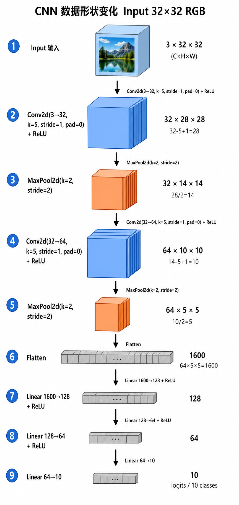

---
tags:
  - pytorch
  - 卷积神经网络
  - CNN
  - 计算机视觉
  - 深度学习
created: 2026-09-01
type: 知识点
aliases:
  - CNN architecture
  - CIFAR-10 Net
  - image classifier
---

# CNN 图像分类模型结构（Net 类）

以 CIFAR-10 教程里的典型小型 CNN 为例，看一个完整图像分类模型怎么搭。结构：`Conv → ReLU → Pool → Flatten → Linear → logits`。

## 卷积层 vs 容器 vs 自定义 Net

| 类 | 职责 | 适用场景 |
| ---- | ---- | ---- |
| `nn.Conv2d`（卷积层） | 执行具体的卷积运算，**有可学习参数** | 任何需要提取空间特征的地方 |
| `nn.Sequential`（容器） | 把多个独立层**按顺序串起来**，不参与计算 | 简单线性结构 |
| 自定义 `Net(nn.Module)` | 比 `Sequential` 灵活得多，支持**复杂数据流**（跳跃连接、残差、多输入输出） | 几乎所有真实模型 |

Net 类继承 `nn.Module`，在 `__init__` 里把层注册进来，在 `forward` 里写数据怎么走——见 [[nn.Module 与模型构建]]。

## `nn.Conv2d(in, out, kernel)` 参数详解

```python
nn.Conv2d(in_channels=3, out_channels=6, kernel_size=5)
```

| 参数 | 含义 | 例里 |
| ---- | ---- | ---- |
| `in_channels=3` | 输入通道数 | RGB 三通道 |
| `out_channels=6` | 输出通道数 = 该层滤波器个数 | 6 个不同核，输出 6 张特征图 |
| `kernel_size=5` | 卷积核 $5\times5$ | 每个滤波器 $5\times5\times3$ |
| `stride` | 步幅，默认 1 | |
| `padding` | 边缘填充，默认 0 | |
| `bias` | 是否加偏置，默认 True | |

无填充时输出尺寸 = (输入 - 核) / stride + 1。详见 [[卷积层与滤波器]]。

## `nn.MaxPool2d(2, 2)` 参数

```python
nn.MaxPool2d(2, 2)   # 第一个 2 = kernel_size，第二个 2 = stride
```

- 滑动窗口在每个 $2\times2$ 区域取最大值
- **无可学习参数**
- 步长 2 直接把高宽折半

详见 [[池化]]。

## forward 流水线

```python
def forward(self, x):
    x = self.pool(F.relu(self.conv1(x)))   # Conv → ReLU → Pool
    x = torch.flatten(x, 1)                  # 跳过 batch 维拉平
    x = F.relu(self.fc1(x))
    x = F.relu(self.fc2(x))
    x = self.fc3(x)                          # logits
    return x
```

> [!tip] 形状流
> 
>
> 输入 `3×32×32` → `conv1`+`pool` → `conv2`+`pool` → flatten → `fc1` → `fc2` → `fc3`，每步的尺寸公式（`32-5+1`、`28/2` 等）见 [[CNN 维度追踪（CIFAR-10 两层卷积）]]。

四步：

1. **卷积 + 激活**：`conv1(x)` 提取空间特征，`F.relu(...)` 引入非线性
2. **池化降维**：缩小高宽，减少后续计算量
3. **展平**：`torch.flatten(x, 1)` 从第 1 维开始拉平，保留 batch 维（dim=0 是 batch_size），输出 2D Tensor 喂给全连接层
4. **全连接分类**：逐层降维（如 400→120→84→10），最后输出 10 类 logits

> [!note] `flatten` 的 dim 参数
> `torch.flatten(x, 1)` =从 dim=1 开始展平。如果不指定默认把整张 Tensor 压成一个向量（连 batch 一起）。对 batch 数据一定要 `flatten(x, 1)` 或保留 `flatten(x, 0)`。

> [!note] 最后一层不加激活
> fc3 直接输出 logits（任意实数），训练用 `CrossEntropyLoss` 直接吃 logits（见 [[交叉熵损失]] / [[Logits、Softmax 与 argmax]]），推理时再 softmax 取 argmax。

## 训练时的辅助工具

```python
for i, data in enumerate(trainloader, 0):
    inputs, labels = data
```

- **`enumerate(iter, start)`**：为迭代结果自动配上从 `start` 开始的整数索引 `i`，用作批次计数或日志
- **`data`**：每步返回的元素（这里是一个包含 `inputs` 和 `labels` 的元组/列表）

## 优化器动量

```python
optimizer = optim.SGD(model.parameters(), lr=0.001, momentum=0.9)
```

`momentum=0.9` 在 SGD 中引入物理"惯性"：**保留 90% 之前的前进方向**，用于
- 加速收敛
- 减少震荡
- 帮助跨越 loss landscape 的小坑

直观：原本只走"梯度反方向"，加动量后还带"上一步方向"的惯性。详见 [[SGD 与优化器]]。

## 完整最小 CNN（CIFAR-10 风格）

```python
class Net(nn.Module):
    def __init__(self):
        super().__init__()
        self.conv1 = nn.Conv2d(3, 6, 5)
        self.pool  = nn.MaxPool2d(2, 2)
        self.fc1   = nn.Linear(6 * 14 * 14, 120)   # 32→28 conv1→14 pool → 6×14×14
        self.fc2   = nn.Linear(120, 84)
        self.fc3   = nn.Linear(84, 10)             # 10 类 logits

    def forward(self, x):
        x = self.pool(F.relu(self.conv1(x)))
        x = torch.flatten(x, 1)
        x = F.relu(self.fc1(x))
        x = F.relu(self.fc2(x))
        x = self.fc3(x)
        return x
```

## 相关笔记

- **核心层**：[[卷积层与滤波器]] / [[池化]] / [[激活函数]] / [[ReLU]]
- **容器**：[[nn.Module 与模型构建]] — Net 类继承 nn.Module
- **输出**：[[Logits、Softmax 与 argmax]] — fc3 输出 logits 怎么用
- **工具**：[[Tensor 基础]] — `torch.flatten` 的形状约定
- **工具**：[[SGD 与优化器]] — momentum 参数详解
- **使用处**：[[Dataset 与 DataLoader]] — `trainloader` + `enumerate` 怎么配合
- **使用处**：[[优化循环与训练闭环]] — model(x) 在 train_loop 里被调用
- **反向传播**：[[反向传播机制]] / [[卷积反向传播]]
- **参数计算**：[[CNN 参数量与核]] — 这张 CIFAR-10 Net 的具体参数怎么算

## 参考

- [PyTorch CIFAR-10 教程](https://docs.pytorch.org/tutorials/beginner/blitz/cifar10_tutorial.html)