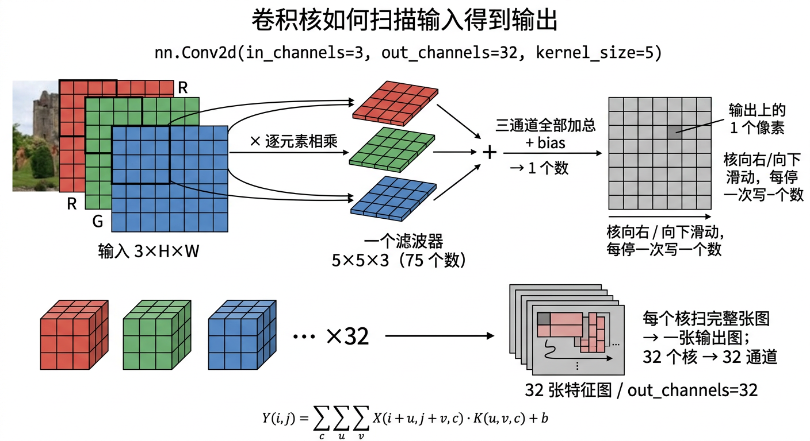

---
tags:
  - pytorch
  - 卷积神经网络
  - CNN
  - 计算机视觉
  - 深度学习
created: 2026-09-01
type: 知识点
aliases:
  - Conv2d
  - convolution
  - 滤波器
  - filter
  - 卷积核
---

# 卷积层与滤波器

**卷积层**（如 `nn.Conv2d`）用一组**可学习的局部模板**（卷积核 / 滤波器）在输入特征图上滑动，每个位置做"逐元素相乘再求和"得到输出。空间上**共享权重**——同一个核在整张图上复用，比全连接层参数少得多，也带来平移不变性。

> [!tip] 整体直觉
> 
>
> 一张 `3×32×32` 的 RGB 图经过 `nn.Conv2d(3, 32, 5)`：每个 $5\times5\times3$ 的核在空间滑动，**三通道逐元素相乘后加总**→ 输出 1 个数；32 个核各自扫完整张图 → 32 张特征图。详见 [[CNN 参数量与核]]。

## 2D 离散卷积公式（单通道）

$$
Y_{i,j}=\sum_{u=0}^{k_h-1}\sum_{v=0}^{k_w-1} X_{i+u,\;j+v}\cdot K_{u,v}+b
$$

- 输入 $X\in\mathbb{R}^{H\times W}$（单通道）
- 核 $K\in\mathbb{R}^{k_h\times k_w}$（一个滤波器对应一个核）
- 偏置 $b$（标量）

## 输出尺寸

无填充（`padding=0`）、步长 $s$ 时：

$$
H_{\text{out}}=\left\lfloor\frac{H-k_h}{s}\right\rfloor+1,\quad W_{\text{out}}=\left\lfloor\frac{W-k_w}{s}\right\rfloor+1
$$

`nn.Conv2d` 默认 `stride=1`、`padding=0`、无指定时无偏置为 False（默认加偏置）。

> [!tip] 那个 `+1` 是怎么来的（篱笆桩问题）
> 卷积把 kernel 在图上滑动，**每停一次产出 1 个数**，输出边长 = 合法停靠次数。
>
> 例：长度 5，核 3，stride 1
> - 窗口：`[0,2]`、`[1,3]`、`[2,4]`
> - 次数：`5-3+1=3`，**不是** `5-3=2`
>
> 3 根桩之间有 2 段，**桩数要再加 1**——这就是 `+1` 的来源。完整公式（包含 padding `p` 和 dilation `d=1`）：
> $$
> H_\text{out}=\left\lfloor\frac{H+2p-k}{s}\right\rfloor+1
> $$
>
> 完整维度追踪的实战例子见 [[CNN 维度追踪（CIFAR-10 两层卷积）]]。

## 滤波器（filter）/ 卷积核（kernel）

**滤波器的本质**：可学习的局部模板，是被优化出来的"模式检测器"（边缘、纹理、角点等）。

名字借自信号处理：
- 一维信号里 $h[n]$ 是频率滤波器（低通/高通/带通）
- 二维图像里它是空间模板

## 为什么逐元素相乘而不是矩阵乘

逐元素相乘再求和 = **"局部加权求和"**：
- $K_{u,v}>0$：该位置像素正向贡献
- $K_{u,v}<0$：抑制
- $K_{u,v}=0$：不参与

如果用全图矩阵乘法：
- 丢失邻域结构（空间局部性）
- 参数爆炸（每个输出位置都要独立权重）
- 无法表达"同一核在图上滑动复用"

CNN的数学直觉来自信号处理：**用固定模板在信号上滑动，计算局部相似度/差分**。

> [!note] 与矩阵乘法的正确关系
> 卷积层内部是"滑动窗口的逐元素相乘求和"；实现层面为了加速，常把卷积改写成矩阵乘法（im2col + GEMM），但数学本质仍是局部卷积。

## 多通道输入与三维核

输入是 $H\times W\times C_{\text{in}}$（如 RGB 是 3 通道）时，每个滤波器变成**三维核**：

$$
K\in\mathbb{R}^{k_h\times k_w\times C_{\text{in}}}
$$

$$
Y_{i,j}^{(m)}=\sum_{c=0}^{C_{\text{in}}-1}\sum_{u,v} X_{i+u,\;j+v,\;c}\cdot K^{(m)}_{u,v,c}+b^{(m)}
$$

含义：在每个空间窗口内，逐通道做逐元素相乘，再把所有通道加起来，得到第 $m$ 个滤波器在该位置的一个标量响应。多个滤波器就得到多个输出通道，整体权重形状 $(C_{\text{out}},\;k_h,\;k_w,\;C_{\text{in}})$。

## `nn.Conv2d(in, out, kernel)` 参数

```python
nn.Conv2d(in_channels=3, out_channels=6, kernel_size=5)   # RGB → 6 个 5×5 滤波器
```

| 参数 | 含义 |
| ---- | ---- |
| `in_channels` | 输入通道数 |
| `out_channels` | 滤波器个数 = 输出通道数 |
| `kernel_size` | 核尺寸（`5` 或 `(5,5)`） |
| `stride` | 步幅，默认 1 |
| `padding` | 边缘填充，默认 0 |
| `bias` | 是否加偏置，默认 True |

无填充时输出尺寸 = (输入 - 核) / stride + 1。

## 一个最简手算例子

输入 $4\times4$，核 $3\times3$，stride=1，padding=0：
- 输出尺寸 = (4-3)/1 + 1 = **2×2**
- 每个位置 =核覆盖的 3×3 区域逐元素相乘再求和

边缘检测核 $\begin{bmatrix}1&0&-1\\1&0&-1\\1&0&-1\end{bmatrix}$（左列减右列），在常见输入上每个窗口结果都相同——因为输入每行差分恒定。

## 与线性层的对比

| | `nn.Linear` | `nn.Conv2d` |
| ---- | ---- | ---- |
| 用途 | 展平后的特征向量 | 保留空间结构 |
| 权重 | 每个输出连接 = 一组权重 | 核在空间上滑动共享 |
| 参数量 | $H_{\text{in}}\cdot H_{\text{out}}$ | $k_h\cdot k_w\cdot C_{\text{in}}\cdot C_{\text{out}}$ |
| 平移不变性 | 无 | 有 |

## 相关笔记

- **使用处**：[[CNN 图像分类模型结构]] — 完整 CNN 架构中的核心层
- **参数量与跨通道加总**：[[CNN 参数量与核]] — 一个核长什么样、75 个数怎么变 1 个数、bias 为什么是 1 个数、参数量公式
- **配对层**：[[池化]] — 卷积后做下采样
- **配对层**：[[激活函数]] / [[ReLU]] — Conv → ReLU → Pool 常见块
- **训练**：[[卷积反向传播]] — Conv 层的反向传播
- **理论工具**：[[反向传播机制]] — 反向传播的总体框架
- **理论工具**：[[矩阵求导]] — $\partial L/\partial K$ 的矩阵形式
- **相关**：[[nn.Module 与模型构建]] — 卷积层作为 `nn.Module` 子类

## 参考

- [PyTorch CIFAR-10 教程](https://docs.pytorch.org/tutorials/beginner/blitz/cifar10_tutorial.html)
- [2D convolution (Wikipedia)](https://en.wikipedia.org/wiki/Convolution)