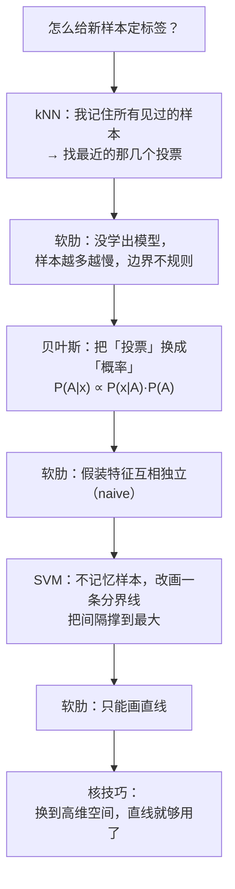

---
tags:
  - 图像分类
  - 监督学习
  - MOC
  - COMP4423
created: 2026-10-06
type: 知识地图
aliases:
  - Image Classification
  - 图像分类
  - L6
  - 图像分类基础
domain: [计算机视觉, 机器学习]
course: COMP 4423 Easy Computer Vision
lecture: [L6]
source: "[L6-Lecture-Image.classification.fundemental-v4.6.pdf](<../../raw/L6-Lecture-Image.classification.fundemental-v4.6.pdf>)"
---

# 图像分类 · 知识地图

本目录对应 **Lecture 6: Image Classification (Fundamental)**。这一讲把前面几讲的东西合起来用：

> [[../特征提取/量化与特征向量|L4 特征提取]] 负责"把图像变成向量" → [[../特征与检索/特征与检索-知识地图|L5 图像检索]] 负责"用向量找相似的东西" → **本讲负责"用向量判断它属于哪一类"**。

课件原文见 [L6 Image Classification](<../../raw/L6-Lecture-Image.classification.fundemental-v4.6.pdf>)（69 页）。

## 本讲最重要的一步：从"聚类"到"分类"

L4 开篇那个"把人像按头发颜色、皮肤颜色分组"的问题，**在 L6 开头被原封不动地再问了一次**（p4 `How do you group them?`）。但这次答案不一样：

| | 聚类 Clustering（L5 [[../特征与检索/K-Means\|K-Means]]） | 分类 Classification（本讲） |
|---|---|---|
| 分组时有人管吗 | **没有**，无监督 | **有**，人先给每类起名字（打标签） |
| 依据 | 数据自己的分布（簇内紧、簇间远） | 人给的标签 |
| 来了个新样本 | **没辙** —— 聚类结果是事后切的，事先不知道新样本属于哪簇 | **能答** —— 拿训练好的模型去预测 |
| 目标 | 发现数据里有什么结构 | 预测一个具体的标签 |

课件 p6 的原话把这层意思点得很准：

> *"Clustering is unsupervised learning, which means we (human) don't have to tell the computers what each group looks like. It's data-driven without using human knowledge (supervision)."*

p7–p9 连续追问两次「But …」，把聚类的软肋逼出来：

- p8 `What if we have new examples unseen?` —— 新样本归哪类？
- p9 `What if the features selected are not representative enough or consistent with our understanding?` —— 特征选得不好怎么办？

p10 给出的答案是 **给数据打标签**（label）。这一下把"人参与"变成了"监督"，于是有了**监督学习**。

## 课件大纲（p3）与笔记对照

| 课件条目 | 对应讲次 | 笔记 |
|---|---|---|
| Classification | p4–p19 | [[分类与聚类的区别]]、[[监督学习与数据集划分]] |
| Supervised learning | p10–p19 | [[监督学习与数据集划分]] |
| K nearest neighbors (k-NN) | p20–p31 | [[kNN 近邻分类]] |
| Bayesian classifiers | p31–p39 | [[贝叶斯分类器]] |
| Support vector machines (SVM) | p40–p53 | [[SVM-线性分隔与最大间隔]] → [[SVM-软间隔与支持向量]] → [[SVM-核技巧]] |
| Rock-Paper-Scissors | p3 大纲提及 | ⚠ 见下方「本讲未覆盖」 |

## 三个分类器，一条递进线索

课件不是平铺直叙三个算法，而是**每讲完一个就顺手指出它的软肋，引出下一个**：

## 详细笔记

- [[分类与聚类的区别]] — 聚类 / 检索 / 分类三者对比；为什么"人给标签"是分水岭
- [[监督学习与数据集划分]] — 训练集 / 验证集 / 测试集；"model"到底是什么
- [[kNN 近邻分类]] — 实例式学习；$k=1$ 与 $k>1$ 多数投票；为什么它其实没学模型
- [[贝叶斯分类器]] — 先验 / 似然 / 决策规则；朴素贝叶斯的"naive"假设与零频问题
- [[SVM-线性分隔与最大间隔]] — $f(\mathbf{x})=\mathrm{sign}(\mathbf{w}^\top\mathbf{x}+b)$；间隔 $\rho$ 与支持向量
- [[SVM-软间隔与支持向量]] — 松弛变量 $\xi_i$；为什么只有支持向量决定分类器
- [[SVM-核技巧]] — $\Phi$ 映射与 $K(\mathbf{x}_i,\mathbf{x}_j)$；三种核函数对照
- [[图像分类-复习自测题]] — 课件 p67–p68 全部 12 题

## 本讲未覆盖 / 不完整

| 内容 | 状态 |
|---|---|
| **Rock-Paper-Scissors**（p3 大纲最后一条） | 课件正文**没有可提取的文字**。相关演示应是 p55–p65 的「The New Toy」，但那 11 页全是图片，文本层为空。**本库不臆造其内容。** 线索：p66 的课后 TODO 提到 `mediapipe`（一个手部追踪库），所以大概率是手势分类 demo |
| **过拟合 / 欠拟合** | 课件 p19、p54 画出了 Validation Set 的位置，但**没有讲解它防的是什么**。见 [[监督学习与数据集划分]] |
| **Precision vs Recall** | 课件 p66 明确列为课后自学 |
| **P(A \| x) 的分母 P(x)** | 课件 p35 写作 $\propto$（正比于），没有展开归一化。见 [[贝叶斯分类器]] |

## 与其他域的接口

这一讲是整条经典 CV 管线的**下游终点**，同时是 [[../卷积网络/CNN 图像分类模型结构|卷积网络]] 那套现代做法的**对照基线**。

| 本讲概念 | 现代对应 | 关系 |
|---|---|---|
| 手工特征 + kNN / SVM | [[../卷积网络/卷积层与滤波器\|卷积层]] + [[../卷积网络/CNN 图像分类模型结构\|CNN]] | **特征不再手工设计，改为学出来** |
| 贝叶斯决策 $P(y\|\mathbf{x})$ | [[../线性模型与分类/Softmax 回归与 MLE 推导\|Softmax 回归]] | 同一个后验概率，参数化方式不同 |
| 硬分类（输出标签） | [[../线性模型与分类/交叉熵损失\|交叉熵损失]] | 从"比大小"变成"最小化对数损失" |
| 线性分隔面 | [[../线性模型与分类/线性回归 解析解与最大似然\|线性回归解析解]] | 都在特征空间里解一个带约束的优化问题 |
| 依赖度量距离 | [[../特征与检索/余弦相似度与欧氏距离\|余弦/欧氏距离]] | kNN 的 $k$ 近邻 = 一次近邻检索 |
| 线性可分性 | [[../特征与检索/数据可分性\|数据可分性]] | "能不能分开"决定 SVM 用硬间隔还是软间隔 |

## 阅读本目录的前提约定

- **场景不预设。** 课件的例子（那 5 个人像、$k=3$ 投票、$P(A)$ 里的 $\#A$）都**从零完整解释**：样本是什么、任务是什么、每一步在做什么。
- **例子要么写全，要么改用通用例子。** 课件页码只作溯源标注，不是理解的前提。
