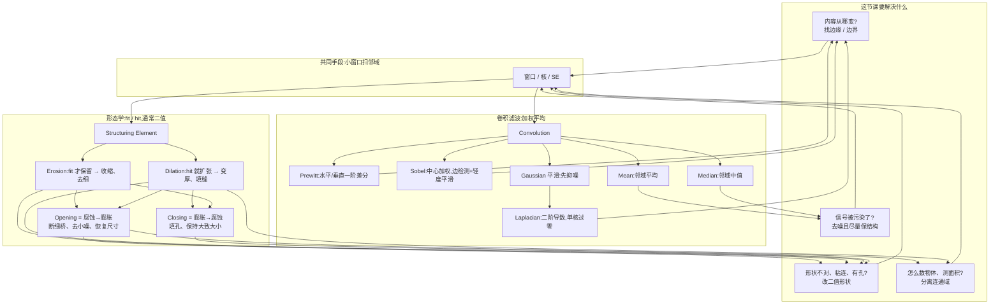

---
tags:
  - opencv
  - 图像处理
  - MOC
created: 2026-09-14
type: 知识地图
aliases:
  - Image Processing 2
  - 局部窗口操作
domain: [计算机视觉, 图像处理]
course: COMP 4423 Easy Computer Vision
lecture: [L2, L3]
source: "[L2-Lecture-Image.processing1-v5.1.pdf](<../../raw/L2-Lecture-Image.processing1-v5.1.pdf>) ; [L3-Lecture-Image.processing2-v4.1.pdf](<../../raw/L3-Lecture-Image.processing2-v4.1.pdf>)"
---

# 图像表示与预处理 · 知识地图

本目录覆盖 COMP 4423 的 **L2 Image Processing 1** 与 **L3 Image Processing 2**，主线是两级递进：

> **L2：整图操作** —— 图像怎么存、怎么读、怎么缩放旋转（作用于整张图或坐标轴）
> **L3：局部窗口操作** —— 用小窗口探测像素邻域：滤波/卷积、边缘、去噪、形态学

另有一组 **PyTorch 衔接笔记**（本课程未覆盖，为进 [[../卷积网络/CNN 图像分类模型结构|卷积网络]] 前的准备）：通道顺序、张量排布、预处理流水线。

课件原文见 [L2 Image Processing 1](<../../raw/L2-Lecture-Image.processing1-v5.1.pdf>)、[L3 Image Processing 2](<../../raw/L3-Lecture-Image.processing2-v4.1.pdf>)。

## 课程大纲

**L2 —— 整图操作**

- 图像表示与读取、通道顺序（RGB / BGR）
- 缩放与插值
- 旋转

**L3 —— 局部窗口操作**

- 滤波与卷积(基础工具)
- 边缘检测(Prewitt / Sobel / Laplacian)
- 去噪(噪声类型 → 滤波选型)
- 形态学(SE + fit/hit)

**自学补充 —— PyTorch 衔接**

- 通道顺序：OpenCV 的 `(H, W, 3)` BGR ↔ PyTorch 的 `(C, H, W)` RGB
- 张量排布：NCHW / NHWC
- 端到端预处理流水线

## 问题驱动总图

## 一句话对照

- **卷积核**:问"邻域加权后是多少?"适合边缘和去噪
- **SE + fit/hit**:问"这个形状能不能放进去 / 有没有碰到?"适合改二值几何
- **Mean vs Median**:平均抹平一切(包括真边缘);中值专打离群点,盐椒噪声更合适
- **Sobel vs Laplacian**:Sobel 一阶、有方向、相对稳;Laplacian 二阶、更尖也更怕噪,所以常先高斯
- **Opening vs Closing**:开运算清小点和细连接;闭运算补小洞、连近邻缺口

## 详细笔记

- [[边缘检测(卷积核)]] — Prewitt / Sobel / Laplacian 核 + nn.Conv2d 自定义 kernel 实战
- [[去噪与平滑滤波]] — 噪声类型与对应滤波器选型
- [[形态学运算]] — SE、腐蚀、膨胀、开闭运算

## 相关笔记

- **前置**:[[OpenCV 是什么]] / [[图像读取与通道顺序]]
- **工具**:[[OpenCV PyTorch 预处理流水线]]
- **格式**:[[NCHW 与 NHWC 张量排布]]
