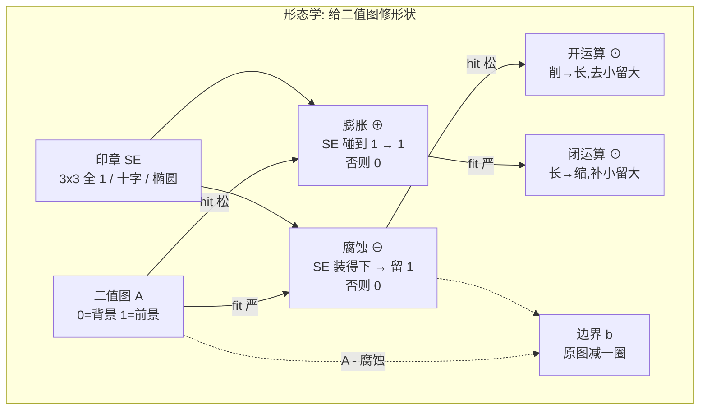

---
tags:
  - opencv
  - 图像处理
  - 形态学
  - 直觉
  - 二值图像
created: 2026-09-15
type: 知识点
aliases:
  - 形态学直觉
  - 形态学印章
  - 严查松查
  - 先削再长
domain: [计算机视觉, 图像处理]
course: COMP 4423 Easy Computer Vision
lecture: [L3]
source: "[L3-Lecture-Image.processing2-v4.1.pdf](<../../raw/L3-Lecture-Image.processing2-v4.1.pdf>)"
---

# 形态学(印章比喻)

[[形态学运算]] 是**操作面**(核长什么样、fit/hit 公式、Python 代码)。本笔记是**直觉面**——用"印章"做比喻,讲清楚**为什么**腐蚀是收缩、膨胀是扩张、开闭运算"先破坏后恢复"的几何意义。

## 一. 二值分割(前置)

形态学只处理二值图(0/1),所以先得有二值图。最简单的办法是**设阈值**:

$$
B(x, y) = \begin{cases} 1 & \text{if } f(x, y) \ge T \\ 0 & \text{if } f(x, y) < T \end{cases}
$$

**例子:亮硬币 / 暗背景**——想提取亮色硬币。如果阈值 T **设太高**,硬币的**边缘/阴影/反射部分**会被误分成背景(因为它不够亮)。结果会得到"中间实,边缘空"的空洞硬币。

## 二. SE = 一颗印章

形态学用一个小的 0/1 矩阵(SE)在二值图上**逐格滑动**。SE 的大小和形状,决定了你认为"什么尺度或形状是重要的"。

- 3×3 全 1 SE:最朴素,无方向偏好
- 3×3 十字 SE:只看上下左右
- 5×5 椭圆 SE:更圆滑,适合圆形目标
- 8 邻域 vs 4 邻域:对角线要不要看

**印章比喻**:SE 就是一颗印章,盖在二值图上盖章。每次盖下去,**用 0/1 矩阵里写好的"检查规则"**决定这个位置盖出来是白还是黑。

## 三. 两种检查方式:严 / 松

印章盖下后,有两种不同的检查规则:

| | fit(严查) | hit(松查) |
| --- | --- | --- |
| **判定** | SE 里**所有** 1 都得对应上原图 1 | SE 里**至少一个** 1 对应上原图 1 |
| **几何效果** | 目标**收缩**(边界向内) | 目标**扩张**(边界向外) |
| **数学等价** | "SE 能**完全放进去**" | "SE 至少**碰到一点**前景" |

直觉解释:

- **fit 严**:你要进入一个房间,要求**脚底全踩地毯**(一个都不踩到地板上)才让进。一个角没踩中就 fail。**前景区边缘的像素,SE 总有一角盖到背景 → 边缘 fail → 目标缩一圈**。

- **hit 松**:你要进入一个房间,要求**至少一只脚踩在地毯上**就让进。最宽松的检查。**前景区外侧,SE 总有一角盖到前景 → 外侧通过 → 目标长一圈**。

> [!tip] 一句话
> **fit 漏一个 = 全 fail;hit 缺一个 = 全 fail。** 两种"全 fail"的方向相反,产生相反的几何效果。

## 四. Erosion = 严检查 = 削

在每个位置问:**SE 装得下原图前景吗?**

- 装得下 → 输出 1(留下)
- 装不下 → 输出 0(削掉)

**集合定义**:
$$
A \ominus S = \{(x, y) \mid S_{(x, y)} \subseteq A\}
$$

**为什么是收缩**:
- 白色目标**边缘**的位置,SE 总有一角盖到背景
- fit 不通过 → 这些边缘位置变 0
- 目标边界向内缩一圈

**孤立白点会消失**:一个单点周围 8 个黑,SE 的 1 全落不进 → fit fail → 整个被削光。

## 五. Dilation = 松检查 = 长

在每个位置问:**SE 碰得到原图前景吗?**

- 碰得到 → 输出 1(扩到)
- 碰不到 → 输出 0(不扩)

**集合定义**:
$$
A \oplus S = \{(x, y) \mid S_{(x, y)} \cap A \ne \varnothing\}
$$

**为什么是扩张**:
- 白色目标**外侧**的位置,SE 总有一角盖到前景
- hit 通过 → 这些外侧位置变 1
- 目标边界向外长一圈

**填充小洞**:洞的位置,SE 一定盖到周围前景 → hit 通过 → 洞被填上。

**连细缝**:两个目标间隔 1 像素,中间那格 SE 盖到两侧 → hit 通过 → 连起来。

## 六. Opening = 削 + 长 = 去小留大

$$
A \circ S = (A \ominus S) \oplus S
$$

**第一步 fit 严**:
- 削掉所有**小于 SE 形状**的白色结构(噪点、细桥、突出)
- 大块目标被削一圈(但还在)

**第二步 hit 松**:
- 大块被削一圈后还在的东西,膨胀回来(恢复原大小)
- **已经消失的小白点,膨胀没东西可接触,长不回来**

**结果**:大块保留,小东西消失。

记忆口诀:**"先削再长,削掉的小东西长不回来"** → **去小**

**典型用途**:数冠状病毒——粘在一起的细桥被削断,可以一个个数。

## 七. Closing = 长 + 缩 = 补小留大

$$
A \bullet S = (A \oplus S) \ominus S
$$

**第一步 hit 松**:
- 填掉所有**小于 SE 形状**的黑色结构(小洞、细缝)
- 大块被填一圈(洞没了)

**第二步 fit 严**:
- 大块被填的东西,腐蚀缩回原大小
- **已经填上的小洞,腐蚀时和周围连成一体,缩不掉**

**结果**:大块保留,小洞被填。

记忆口诀:**"先长再缩,补上的小东西缩不掉"** → **补小**

**典型用途**:修补"字母 O"的笔画断口、白点物体内部的黑洞。

> [!tip] 为什么先破坏后恢复能做到"修形状"?
> 腐蚀/膨胀的"破坏"是**单向、不可逆**的:小目标被削掉就是没了,小洞被填上就是填了。第二步的"恢复"只能恢复**幸存**的,不能恢复**已消失**的。所以"先破坏后恢复"= 用第二步把第一步的副作用"扫干净",只留下对幸存结构的尺寸修正。

## 八. 形态学 vs 线性滤波

| | 线性滤波(卷积) | 形态学(SE) |
| --- | --- | --- |
| 元素 | 任意实数(权重) | 0 / 1(检查标记) |
| 操作 | 加权求和 | fit / hit 逻辑判断 |
| 输出 | 实数 | 二值 0 / 1 |
| 改变 | 像素**灰度** | 前景**形状** |
| 关注 | "邻域加权后是多少?" | "邻域形状能放进去 / 碰得到吗?" |

**这是两类完全不同的"窗口"**——看 `[[边缘检测(卷积核)]]` 和 `[[形态学运算]]` 的对比,你会发现笔记里所有"核"分两族,不要混。

## 九. 一张总图



## 十. 形态学自己的流水线:数冠状病毒

把开闭运算套到课堂上"数冠状病毒"案例:

```
原图(白点=病毒,有噪、有粘连)
   ↓ Opening(去噪 + 断粘连)
白点个数 = 病毒数(腐蚀时细桥断,膨胀没东西长回来)
   ↓ 对每个白点做 Dilation
mask(每个白点都膨胀成覆盖病毒的圆盘)
   ↓ mask AND 原图
分离的单个病毒 → 可测面积
```

> [!warning] 流水线是**形态学专用**,不要混到边缘/去噪那套里
> 这里全程是二值图上的 fit/hit,不是卷积核的加权求和。

## 十一. 边界提取(顺带的妙用)

$$
b = f - (f \ominus s)
$$

**原图减腐蚀,只留下边缘那一圈**。

为什么:**腐蚀把目标都往里缩一圈**,边界上的像素在原图是 1,腐蚀后是 0 → 一减就出来。

## 一句话

> **SE 是印章,fit 是严查(漏一个就 0),hit 是松查(缺一个就 0);开运算"先削再长,小东西长不回来"去小,闭运算"先长再缩,小东西缩不掉"补小。**

## 相关笔记

- **操作面**:[[形态学运算]] — 核的结构、记号约定、Python 代码实现
- **总览**:[[图像表示与预处理-知识地图]]
- **对比**:[[边缘检测(推导与直觉)]] / [[边缘检测(卷积核)]] — 卷积核(加权平均)和 SE(fit/hit)是两类不同"窗口"
- **前置**:[[图像读取与通道顺序]] — 二值化前先正确读图
