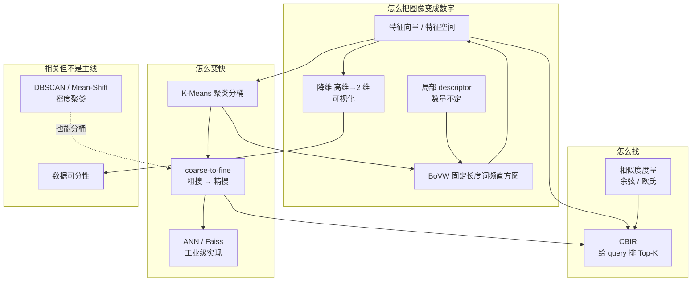

---
tags:
  - opencv
  - 图像检索
  - MOC
created: 2026-09-29
type: 知识地图
aliases:
  - Image Retrieval
  - Lecture 5 图像检索
  - 图像检索
---

# 课程知识地图

本讲对应 **Lecture 5: Image Retrieval**。主线只有一句：**把图像变成特征向量，然后在特征空间里做聚类、检索、以及加速检索。**

```text
起点：图像 ──特征提取──> 特征向量

分出四条路，各解决一个问题：
  ① 有了 query 怎么找     → CBIR 相似度排序取 Top-K
  ② 库太大逐张比太慢     → K-Means 聚类分桶 → 粗搜 + 精搜
  ③ 一张图有多个局部特征  → BoVW 视觉词袋 → 固定长度直方图
  ④ 高维看不见            → PCA / t-SNE 降到 2 维
```

## 问题驱动总图



注意方向：**K-Means → BoVW** 是成立的（词典中心就是 visual word），反过来不成立。**密度聚类是 K-Means 的替代品，不是它的下游。**

## 一句话对照

- **特征向量**：检索的原子单位。**特征提取器决定检索质量的上限**。
- **K-Means**：不看 query，把整个库自动分组（簇内紧、簇间远）。
- **CBIR**：给一张 query，在库里按相似度排序返回 Top-K。**这是检索，不是分类**。
- **coarse-to-fine**：用 K-Means 的簇中心当索引代表，少搜一些地方换速度。
- **BoVW**：把数量不定的局部描述子，量化成固定长度的词频直方图，**代价是丢掉空间布局**。
- **PCA**：找方差最大的几个新方向投影过去，主成分是原始特征的**线性组合**。
- **SVD**：任意矩阵（含长方阵）都能分解，PCA 实际就用它算。

## 三个关键词的分工

| | 解决的核心问题 |
| --- | --- |
| **K-Means** | 库里没有 query 时，怎么把 $N$ 张图分成 $K$ 组？ |
| **CBIR** | 有了 query，怎么找到最像它的图？ |
| **BoVW** | 一张图有 50 个局部特征、另一张有 500 个，怎么公平比较？ |

## 详细笔记

- [[图像特征空间]] — 特征向量从哪来，特征空间是什么
- [[K-Means]] — 分配—更新循环、取均值的理由、五条局限
- [[CBIR 基于内容的图像检索]] — 检索流程、检索 vs 分类
- [[余弦相似度与欧氏距离]] — 两个度量各自丢掉/保留什么
- [[粗到细检索]] — indexing 的加速与召回率代价
- [[Bag of Visual Words]] — codebook、量化、词频直方图
- [[降维与 PCA]] — 512 维到 2 维的完整推导
- [[特征值与特征向量]] — 从线性变换本质出发
- [[奇异值分解 SVD]] — 奇异值为什么存在
- [[密度聚类]] — DBSCAN、Mean-Shift 与 K-Means 的分工
- [[近似最近邻检索]] — 精确 vs ANN，Faiss
- [[数据可分性]] — 线性可分、可分性依赖特征质量

## 复习

- [[复习自测题]] — 本讲全部自测题 + 必须记住的数字

## 相关笔记

- **前置**：[[图像预处理/课程知识地图]] — 局部窗口操作是"像素邻域"层面的事，本讲是"特征向量"层面
- **同线**：deeplearning vault 的 [[卷积层与滤波器]] / [[CNN 图像分类模型结构]] — 深度特征那一路
