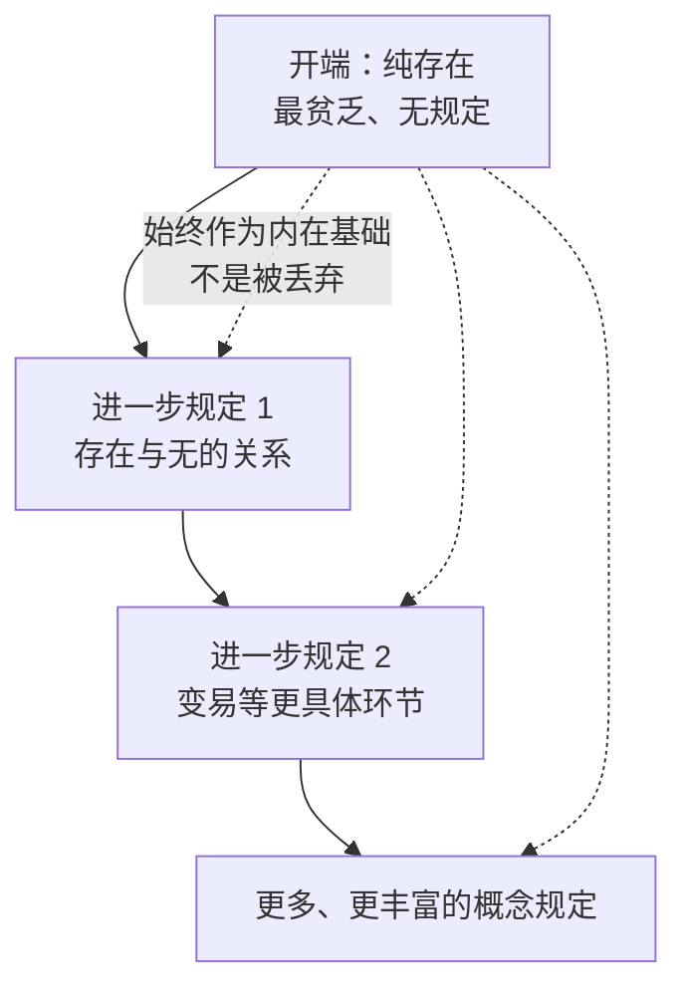

# 开端（Anfang）

## 一句话
开端 = 逻辑学第一句该落的地方。它不是"宇宙第一秒",而是整条思想链条上**不能再往前接的那一环**;这一环必须既无规定、无前提,又能从自身展开出后面一切——纯存在。

## 开端不是"原理"

黑格尔先分两件事:

- **原理**(Grund) = 客观上什么最根本(水、理念、我、思维……)
- **起点**(Anfang) = 思想链条的第一项,叙述的第一句

朴素说法:
> 原理 = "房子的地基是什么材料"
> 起点 = "施工时第一块砖砌哪一块"

很多人抢答原理,却少问第一块该是哪个——黑格尔认为前者其实暗含后者:**真的原理,应当正好是思考时能落脚的第一项**。

## 开端的标准

一个真正的开端必须满足:

1. **无前提**——不能再拿别的东西当前提
2. **无规定性**——不能说它"是什么",一说就装进了内容
3. **可展开**——后面的内容能从自身内部推出来,不是从外面拼上去
4. **作为根据**——开端应当同时是原理

数学里的类比:不能从"三角形内角和 180°"起笔,那是定理。真正的起点像"先有点、线、相等这些几乎还没内容的规定"。

## 为什么是"纯存在"

唯一合要求的开端 = **纯存在(reines Sein)**:
- 它没有任何规定性,所以无前提
- 它太空,所以不能再退,反而不得不往前走
- 它直接就是最贫乏的思想内容,所以不可绕过

这一环不只是"随便选的开场白"——黑格尔要反驳的恰恰是把"先写哪一句"看作无关紧要的常识。**起点与原理的同一**,是逻辑学能否自足的关键。

## 开端的"种子性"

开端不是死的空无,后面也不是外部堆上去的——后面是开端的"自我展开":

类比:成年树不是一粒种子,也不是种子简单放大;它是种子在条件下展开的结果。**后续环节由开端内在地、不矛盾地推出**——这才是"哲学科学体系"的判据。

## "保持自身"≠ 不变化

容易被误读为"纯存在原封不动地藏在每个后续概念里"。其实:

- **被否定**——开端过于空洞,不能停在那
- **被保留**——不能完全抛弃开端
- **被提升**——纳入更丰富的整体

三个动作同时发生 = [[概念/扬弃]]。

## 开端的两层结构

逻辑学的开端有一道常被忽略的"双重入口":

| 路径 | 性质 | 来源 |
|:--|:--|:--|
| **回看路径** | 存在是被达到的——有限意识经反思才到达纯粹存在 | 《精神现象学》 |
| **内部推论** | 存在是必然的——逻辑要无前提地开始,只能落在无规定的直接性上 | 《逻辑学》自身 |

同一结果、两条来路,见 [[存在/开端/中介的消解|中介的自我消解]]。

## 开端本身的矛盾

"开端"概念自带张力:
- 一方面它应当"什么都还没存在"——还不许具体某物出现 → 像"无"
- 另一方面它应当能"开始"——能过渡到某物 → 含有"有"

**有与无的统一 = 变易**(参见 [[存在/纯有与纯无]]、[[存在/变易]])。所以开端的内在结构在第一章就已经展开了。

## 一句抓住要害

> 开端不是"莫名其妙选来、碰巧有用的工具",而是逻辑学无前提地开始研究纯思维时,唯一合要求的那个最贫乏、最无规定的思想内容——纯存在。

## 相关

- 内部页
  - [[存在/开端/原理与起点]] — 区分"地基材料"与"第一块砖"
  - [[存在/开端/纯粹知识]] — 怎样把一切对象抽掉,只剩"思维自身"
  - [[存在/开端/中介的消解]] — 回看路径与内部推论如何汇合
- 同篇
  - [[存在/纯有与纯无]]、[[存在/变易]]、[[存在/直接性]]
  - [[存在/存在-总览]] — 存在论三阶段的展开
- 跨篇
  - [[0_逻辑学/逻辑学-三篇框架]] — 开端在三大篇中的位置
  - [[概念/扬弃]] — 开端"被否定+被保留+被提升"的辩证动作
  - [[_辩证法与当代/老子与黑格尔]] — 对照"有生于无"与"有=无"