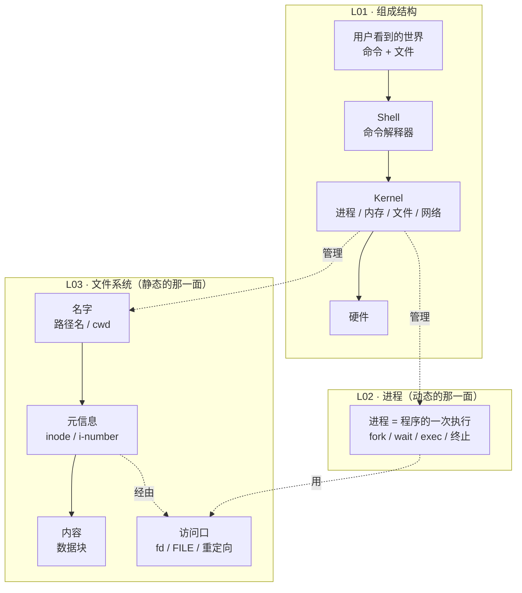

---
tags:
  - 系统编程
  - Unix
  - MOC
  - COMP3438
created: 2026-10-07
type: 知识地图
aliases:
  - System Programming
  - 系统编程
  - Unix 系统编程
  - COMP3438
domain: [操作系统, 系统编程]
course: COMP3438 System Programming
lecture: [L01, L02, L03]
source: "[01-Overview-of-Unix.pdf](<../raw/01-Overview-of-Unix.pdf>) ; [02-Unix-Processes.pdf](<../raw/02-Unix-Processes.pdf>) ; [03-Unix-File-System.pdf](<../raw/03-Unix-File-System.pdf>)"
---

# 系统编程知识库 · System Programming MOC

本目录对应 **COMP3438 System Programming** 的 Part I（Unix System Programming / Device Driver Development），目前覆盖前三讲：

| 讲次 | 课件 | 页数 | 主题 |
|---|---|---|---|
| L01 | Overview of Unix | 28 | Unix 是什么、由哪几部分组成、凭什么能用 |
| L02 | Unix Processes | 45 | 进程与线程、进程创建/等待/替换/终止 |
| L03 | Unix File System | 64 | 文件类型、层次结构、inode、文件描述符、I/O |

课件原文见 `notes/raw/` 下的三份 PDF。

本域的整理过程、课件中未展开的内容清单，见 [[log|沉淀日志]]。

## 课程定位（p2）

课件 p2 给出的课程分块：

- **Part I: Unix System Programming**（Device Driver Development）— 本目录目前覆盖的部分
  - Overview of Unix Systems Programming（= L01）
  - Process File System（= L02 + L03）
  - Overview of Device Driver Development（尚未整理）
  - Introduction to Block / Character Device Driver（尚未整理）
- **Part II: Compiler Design**（尚未整理）
  - Overview of Compiler Design / Lexical Analysis / Syntax Analysis

> **本目录只覆盖到 L03。** 设备驱动与编译器设计两块还没有笔记。

## 主线：三层抽象

Unix 的设计可以看成**同一件事做了三遍，每遍都加一层抽象**。这个视角能把三讲串起来：

**一句话概括**：L01 讲**谁在管**（Shell 指挥 Kernel 指挥硬件），L02 讲**动的东西怎么生灭**（进程），L03 讲**不动的东西怎么寻址和读写**（文件）。

## 七个主题域

| 域 | 篇数 | 覆盖 | 核心问题 |
|---|---|---|---|
| `Unix 总览` | 5 | L01 | Unix 由哪几块组成？为什么这样设计？ |
| [[进程与线程/进程是什么|进程与线程]] | 2 | L02 p3–p16 | 进程是什么？为什么还需要线程？ |
| [[进程管理/进程标识与查看|进程管理]] | 6 | L02 p17–p45 | 进程怎么被创建、等待、替换、终止？ |
| [[文件系统结构/文件类型|文件系统结构]] | 4 | L03 p4–p14 | 文件有哪几类？谁有权限？名字怎么组织？ |
| [[inode 与链接/inode 与目录文件|inode 与链接]] | 3 | L03 p15–p34 | 文件名到内容的链路是怎么走的？ |
| [[文件描述符与流/文件描述符与 SFT|文件描述符与流]] | 3 | L03 p35–p53 | 程序怎么读写文件？ |
| [[重定向与管道/I O 重定向与 dup|重定向与管道]] | 2 | L03 p54–p64 | 怎么把一个进程的输出接到另一个进程的输入？ |

## 详细笔记

### Unix 总览（L01）

- [[Unix 是什么与由来]] — 家族树、POSIX、1973 年改写成 C
- [[Unix 组成结构]] — Kernel / Shell / 命令 / 库 / 驱动器的分层图
- [[Unix 哲学与工具组合]] — 小工具 + 组合器（`>` `>>` `<` `|`）= 复杂功能
- [[Unix 的特性]] — 可移植、多用户、多任务、层次 FS、Shell、管道、网络、健壮
- [[Unix 家族与变体]] — Linux / Android / macOS 与 Unix 的关系

### 进程与线程（L02）

- [[进程是什么]] — 定义、"状态" 的严格含义、程序变成进程的四步
- [[进程映像与线程]] — 进程映像包含什么；线程共享什么、不共享什么

### 进程管理（L02）

- [[进程标识与查看]] — PID / PPID / UID、父子层级、`ps -l`、三个 `get*` 函数
- [[fork 创建进程]] — 复制语义、返回值的两种含义、链式与扇形 fork
- [[wait 等待子进程]] — `wait` / `waitpid`、孤儿进程、`ECHILD` / `EINTR`
- [[exec 替换进程映像]] — 六个变体的区别、**`exec` 成功则不返回**
- [[进程终止]] — 正常终止四条路径 vs 异常终止
- [[后台进程与守护进程]] — `&`、`ctrl-c`、daemon 的两级 fork

### 文件系统结构（L03）

- [[文件类型]] — 普通文件 / 块设备 / 字符设备；**设备也是文件**
- [[权限位与 ls -l]] — 类型字符 + 9 位权限
- [[层次结构与路径名]] — 树、绝对路径 vs 相对路径
- [[当前工作目录]] — cwd、`.`、home、`getcwd` 与 `ERANGE`

### inode 与链接（L03）

- [[inode 与目录文件]] — 文件名到底存在哪（**i-node 里没有文件名**）
- [[硬链接与符号链接]] — 两个名字指向同一个 inode vs 一个存放路径的文件
- [[名称解析与文件大小上限]] — 路径名 → i-number 的遍历；多级间接寻址

### 文件描述符与流（L03）

- [[文件描述符与 SFT]] — fd 是什么、0/1/2、进程 fd 表 → 系统文件表
- [[open read write close]] — 四个系统调用与错误检查
- [[FILE 流与格式化输入输出]] — `FILE*` 是 handle 的 handle、`fopen` 模式串、`printf` / `scanf`

### 重定向与管道（L03）

- [[I O 重定向与 dup]] — 重定向的本质是改 fd 表项；`dup` 怎么实现 `>`
- [[管道与进程间通信]] — `pipe()` 的两个 fd、父子进程通信

## 阅读本目录的前提约定

- **场景不预设。** 任何例子（`fork` 之后两个进程各看到什么、`cp /etc/passwd /dev/tty` 会发生什么、`> ` 重定向前后 fd 表的变化）都**从零完整解释**：初始状态是什么、操作做了什么、结果为什么是这样。
- **每篇自足。** 课件页码只作溯源标注，不是理解的前提；不写"如上例所示"。
- **术语中英对照**，便于对照课件和英文考试。

## 本目录尚未覆盖

| 内容 | 课件位置 | 原因 |
|---|---|---|
| Device Driver Development | L01 p2 提及 | 属于 Part I 的后半，尚未有笔记 |
| Block / Character Device Driver | L01 p2 提及 | 同上；但 [[文件类型]] 已介绍设备文件在用户侧的样子 |
| Compiler Design / Lexical Analysis / Syntax Analysis | L01 p2 提及 | Part II，尚未有笔记 |
| 文件的创建、定位、重命名、删除 API | L03 p64 | 课件 p64 只写了一句"详见 C 库文档"，未展开 |